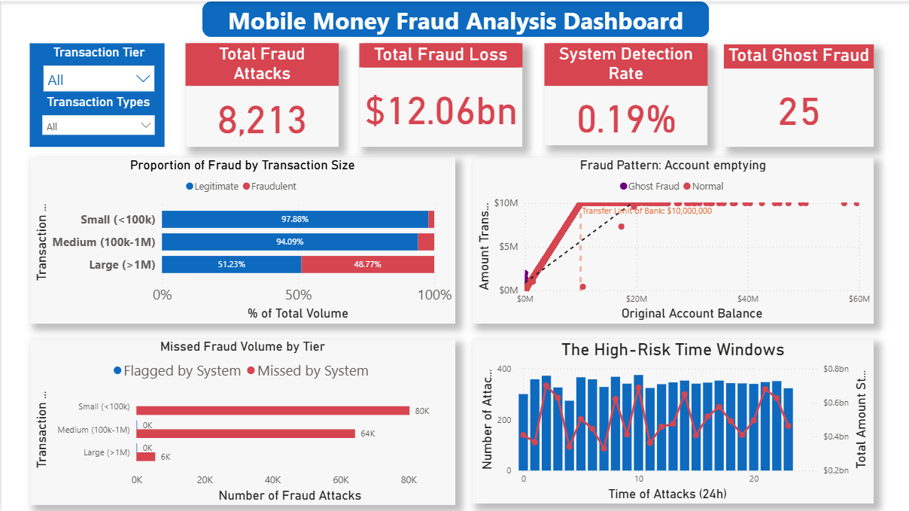
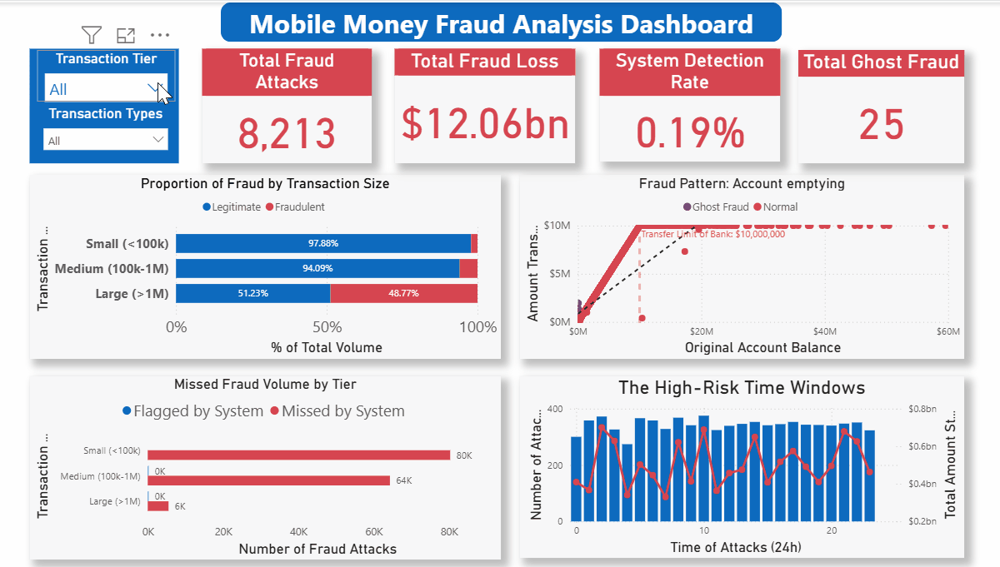

# 🛡️ Mobile Money Fraud Analysis Dashboard

### 📌 Project Overview
* **Role:** Financial Analyst / Risk Analyst
* **Tools:** SQL (PostgreSQL), Power BI, Python (EDA)
* **Domain:** Fintech / Revenue Protection

This project analyzes **150,000+ mobile money transactions** to identify fraud patterns, specifically focusing on **"Account Takeover"** signatures and **"Zero-Balance"** vulnerabilities. The resulting dashboard provides a real-time view of **12.06bn dollars** in detected fraud exposure.

### 🔍 Key Findings (The "Gap Analysis")
*  High-Value transactions (>1M) have a 48.8% fraud rate, compared to only 2.1% for small transactions (<100k), and  5.9% for medium transactions (100k - 1M).
*  Identified **25 incidents** where fraudsters successfully cashed out from accounts with a **0.00 balance**, bypassing the synchronous balance check.
*  Fraudsters are consistently hitting the **10 million dollar system limit**, creating a distinct "ceiling" pattern in the data.
*  The previous system had a **0.19% Detection Rate**, flagging only **16 out of 8,213** attacks. Critically, it **completely ignored Cash-Out fraud**, flagging only Transfers, leaving the Cash-Out vector 100% exposed.

### 📊 Dashboard Demo
*(See the dashboard in action)*

### 🛠️ Technical Workflow
1.  **SQL:** Performed stratified sampling on the raw PaySim dataset (6M rows) to extract a statistically significant sample (150k rows) comprising all fraud vectors and a control group of legitimate transactions.
2.  **Power BI (DAX):** Created calculated columns and measures for to quantify the security gap and better analyse the data.
3.  **Visualization:** Implemented a "Z-Pattern" layout for executive storytelling, utilizing Scatter Plots for correlation analysis and Combo Charts to track the velocity.

### 📂 Files Included
* **`Fraud_detection_analysis.pbix`**: The fully interactive Power BI source file.
* **`fraud_detection_analysis.sql`**: The SQL scripts used for data extraction and sampling.
* **`fraud_analytics_data.csv`**: The processed dataset used for this analysis.
